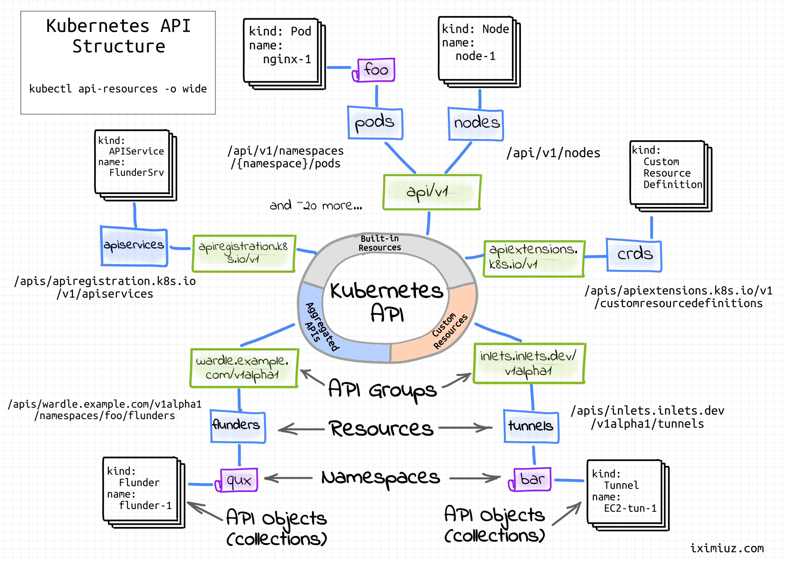

# Extending Kubernetes API

## Custom Resource Definitions (CRDs)
View all Resources:
```commandline
kubectl api-resources
```
TODO:

## ApiService and Aggregation Layer
### API Server
The API Server is the gateway to the Kubernetes cluster. 
It is the central touch point that is accessed by all users, automation, 
and components in the Kubernetes cluster. 
The API server implements a RESTful API over HTTP, performs all API operations, 
and is responsible for storing API objects into a persistent storage backend.
API Server is a part of Control Plane.
#### API conventions
See [link](https://github.com/kubernetes/community/blob/7f3f3205448a8acfdff4f1ddad81364709ae9b71/contributors/devel/sig-architecture/api-conventions.md#verbs-on-resources)
#### Access API Server via command line
Find API Server host and port:
```commandline
kubectl cluster-info
```
```commandline
export KUBE_API=$(kubectl config view -o jsonpath='{.clusters[0].cluster.server}')
```
```commandline
curl --cacert ~/.minikube/ca.crt $KUBE_API/version
```
cacert flag is used to specify the CA certificate file to verify the server certificate,
otherwise Minikube's self-signed certificate will not be trusted.

View raw API paths:
```commandline
kubectl proxy
curl http://localhost:8001/
```

Query deployments
```commandline
curl localhost:8001/apis/apps/v1/deployments |  jq '.'
```

Send raw requests:
```commandline
kubectl get --raw /api/v1/namespaces/default/pods |  jq '.'
```

#### Access API Server via client libraries
[Python client example](https://kubernetes.io/docs/tasks/administer-cluster/access-cluster-api/#python-client)

[Access custom API](https://github.com/kubernetes-client/python/blob/master/kubernetes/docs/CustomObjectsApi.md)
The docs also specify HTTP requests for each API operation.

Go - client-go library

#### Metrics server API
Check metrics API before installation:
```commandline
curl http://localhost:8001 | grep metrics
```

Install the metrics server with disabled certificate validation:
```commandline
kubectl create namespace metrics-server
helm upgrade --install metrics-server metrics-server/metrics-server --set args="{--kubelet-insecure-tls}" -n metrics-server
```

Check metrics API after installation:
```commandline
curl http://localhost:8001 | grep metrics
```
New metrics API should be available:
```text
"/apis/metrics.k8s.io",
"/apis/metrics.k8s.io/v1beta1",
```

Describe the 
```commandline
kubectl describe apiservice v1beta1.metrics.k8s.io
```

##### metrics-server registration
See metrics-server components in `apiservice-example/metrics-server-example/metrics-server.yaml`

##### metrics-server REST API implementation
See `pkg/api/pod.go` in metrics-server source code

# References
[Working with Kubernetes API Series](https://iximiuz.com/en/series/working-with-kubernetes-api/)
[Metrics server tutorial](https://kubernetes.io/docs/tasks/run-application/horizontal-pod-autoscale-walkthrough/)


