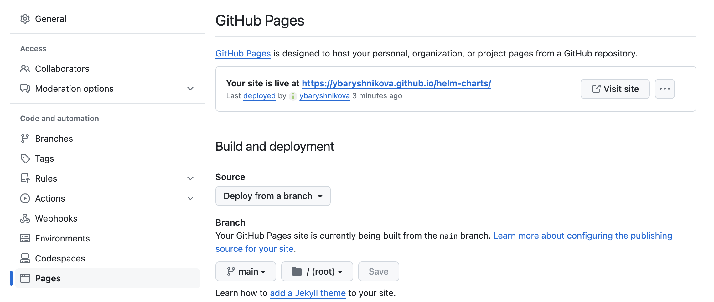

# Helm

## Intro
Usually there is a need to work with multiple manifests in Kubernetes. 
E.g. adding an ApiService requires a deployment, a service, and a ApiService manifest.
Then they may be installed in different environments with different parameters.
Helm is to help with that. Also, lots of api extensions are distributed as Helm charts.
Helm is a package manager for Kubernetes. It allows to package and deploy applications in Kubernetes.

## Helm chart structure overview
A Helm chart is a collection of files organized in a specific directory structure.
The configuration information related to a chart is managed in the configuration file `values.yaml`.
A running instance of a chart with a specific config is called a release.
Releases are stored as Secrets by default in the namespace of the release directly. Previously, in Helm 2, releases were stored in ConfigMaps.
Helm uses a templating system based on Go template to render Kubernetes manifests from charts.
A chart is a consistent structure separating templates and values.

## Chart dependencies overview
As a package, a chart can also manage dependencies with other charts.
For example, if your application needs a MySQL database to work you can include the chart as a dependency.
When Helm runs at the top level of the chart directory it installs whole dependencies.
You have just a single command to render and release your application to Kubernetes.

## Helm versioning overview
Helm charts use versions to track changes in your manifests – thus you can install a specific chart version for specific infrastructure configurations.
Helm keeps a release history of all deployed charts in a dedicated workspace.
This makes easier application updates and rollbacks if something wrong happens.

## Helm chart sharing overview
Helm allows you to compress charts.
The result of that is an artifact comparable to a Docker image.
Then, you can send it to a distant repository for reusability and sharing.

## Create a chart
```commandline
helm create chart-example
```

## Install a chart
```commandline
helm install release1 ./chart-example
helm get manifest release1
```

### Inspect helm-packaging/chart-example:
#### Templates
Stores parameterized Kubernetes manifest files. The templating language is Go's text/template.
NOTES.txt is a special template that is rendered when the chart is deployed.
_helpers.tpl is a special template that contains reusable templates and functions.
#### values.yaml
Default values for the chart. These values can be overridden by passing them in with the --set flag or -f flag.
#### Chart.yaml
Contains metadata about the chart, such as the type, version, description.
#### .helmignore
Contains files that should be ignored when packaging the chart.
#### charts/
Contains dependencies for the chart.

### Wait for the deployment to be ready
#### Wait for Pods, Services, PVCs and Deployments to be ready:
```commandline
helm install release1 ./chart-example --wait
```
#### Wait for jobs:
```commandline
helm install release1 ./chart-example --wait-for-jobs
```
#### Post-install hook to wait for an APIService to be available
```yaml
apiVersion: batch/v1
kind: Job
metadata:
  name: wait-for-apiservice
  annotations:
    "helm.sh/hook": post-install
    "helm.sh/hook-weight": "0"
    "helm.sh/hook-delete-policy": hook-succeeded,hook-failed
spec:
  template:
    spec:
      serviceAccountName: apiservice-waiter
      containers:
        - name: wait-for-apiservice
          image: bitnami/kubectl:1.21
          command:
            - /bin/sh
            - -c
            - |
              set -e
              echo "Waiting for ApiService to be available..."
              kubectl wait --for=condition=Available --timeout=120s apiservice v1alpha1.example.com
      restartPolicy: Never
  backoffLimit: 4
```

#### install CRD before other resources
For a CRD, the declaration must be registered before any resources of that CRDs kind(s) can be used. 
To achieve that put CRDs in `crd` folder. Helm will install them first.
These CRDs are not templated, but will be installed by default when running a helm install for the chart. 
If the CRD already exists, it will be skipped with a warning. 
To skip the CRD installation step pass the --skip-crds flag.
There is no support at this time for upgrading or deleting CRDs using Helm.
A possible solution is to store the CRD in a separate chart and install it before the main chart.
See more info in [Helm docs](https://helm.sh/docs/chart_best_practices/custom_resource_definitions/).

## Update a chart
```commandline
helm upgrade release1 ./chart-example
```

## View releases
```commandline
helm list
```

## Release history
```commandline
helm history release1
```

## Uninstall a release
```commandline
helm uninstall release1
```

## Run with individual params
```commandline
helm install custom-release ./chart-example --dry-run --debug --set image.pullPolicy=IfNotPresent
```
The `--dry-run` flag of `helm install` and `helm upgrade` is not currently supported for CRDs.

## Debugging
```commandline
helm install --debug --dry-run test-run ./chart-example
```

## Some best practices
.yaml for YAML files and .tpl for helpers are recommended.

Keep your values trees shallow, favoring flatness.

Creating a NOTES.txt file is strongly recommended, though it is not required.

The .helmignore file is used to specify files you don't want to include in your helm chart.

## Publish to Github
Package the chart into a .tgz file
```commandline
helm package chart-example/
```
This command will create a .tgz file in your current directory.

Create an index.yaml file:
```commandline
helm repo index --url https://<github-username>.github.io/<repo-name>/ .
```

Add the packaged chart (chart-example-0.1.0.tgz) and index.yaml to your repository.
Commit and push these files to your repository.

Enable GitHub Pages: in your repository, go to the Settings tab, find the Pages section, and select the branch and folder where your charts are located (usually main or master and / (root)).
GitHub Pages provides a convenient way to host static content directly from a GitHub repository



Use your repo:
```commandline
helm repo add myrepo https://<username>.github.io/<repository>/
helm repo update
helm install myrelease myrepo/chart-example
```
## Links
[Helm tutorial](https://helm.sh/docs/chart_template_guide/getting_started/)
[Helm best practices](https://helm.sh/docs/chart_best_practices/)
